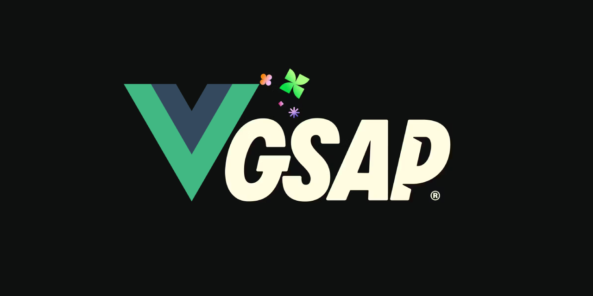

# @c5vagas/gsap-vue for using GSAP in Vue.js



[](https://www.npmjs.com/package/gsap-vue)
[](https://vuejs.org/)
[](https://greensock.com/gsap/)
[](https://stackblitz.com/edit/vitejs-vite-teslnzdm?file=index.html)

A Vue 3 Composable for using GSAP with context, inspired by [@gsap/react](https://github.com/greensock/react).

## Features

- ✅ Fully compatible with Vue 3 Composition API  
- ✅ Automatic GSAP context handling and cleanup  
- ✅ Optional scope for selector text (no need for multiple refs)  
- ✅ Dependency tracking (`reactivity-aware`)  
- ✅ `contextSafe` for event listeners and delayed callbacks  
- ✅ Headless mode for SSR or non-browser environments  

## Installation

```bash
npm install gsap gsap-vue
# or
yarn add gsap gsap-vue
```

## Basic Usage

```vue
<script setup lang="ts">
import { useGSAP } from "gsap-vue";
import { ref } from "vue";
import gsap from "gsap";

const box = ref<HTMLDivElement | null>(null);

useGSAP(() => {
  gsap.to(box.value, { x: 100, duration: 1 });
}, { scope: box });
</script>

<template>
  <div ref="box">Animated</div>
</template>
```

## API

* `useGSAP(callback, config?)` — Core composable for GSAP animations.
* `useGSAP.register(core: typeof gsap)` — Replace GSAP core if needed.
* `useGSAP.headless = true` — Enable headless mode for SSR or tests.

### The config object supports:

- scope → limits selector text to a container ref
- dependencies → reactive dependencies to re-run animations
- revertOnUpdate → revert context on dependency change

## Examples

### ❌ Without `useGSAP` (manual)

```vue
<script setup lang="ts">
import { onMounted, onBeforeUnmount, ref } from "vue";
import gsap from "gsap";

const box = ref<HTMLDivElement | null>(null);
let ctx: gsap.Context | null = null;

onMounted(() => {
  ctx = gsap.context(() => {
    gsap.to(box.value, { rotation: 360, duration: 2 });
  }, box);
});

onBeforeUnmount(() => ctx?.revert());
</script>

<template>
  <div ref="box" class="box">Manual Animation</div>
</template>
```

### ✅ With `useGSAP` (simplified)

```vue
<script setup lang="ts">
import { useGSAP } from "gsap-vue";
import { ref } from "vue";
import gsap from "gsap";

const box = ref(null);

useGSAP(() => {
  gsap.to(box.value, { rotation: 360, duration: 2 });
}, { scope: box });
</script>

<template>
  <div ref="box" class="box">Easy Animation</div>
</template>
```

### Using dependencies

```vue
<script setup lang="ts">
import { useGSAP } from "gsap-vue";
import { ref } from "vue";
import gsap from "gsap";

const box = ref(null);
const endX = ref(200);

useGSAP(() => {
  gsap.to(box.value, { x: endX.value, duration: 1 });
}, { dependencies: [endX], scope: box });
</script>

<template>
  <button @click="endX += 100">Move Further</button>
  <div ref="box" class="box"></div>
</template>
```

### `contextSafe` for event listeners

```vue
<script setup lang="ts">
import { useGSAP } from "gsap-vue";
import { ref } from "vue";
import gsap from "gsap";

const container = ref(null);

const { contextSafe } = useGSAP({ scope: container });

const onClick = contextSafe(() => {
  gsap.to(".box", { y: 100, stagger: 0.2 });
});
</script>

<template>
  <div ref="container">
    <button @click="onClick">Animate</button>
    <div class="box"></div>
    <div class="box"></div>
    <div class="box"></div>
  </div>
</template>
```

### Scoped selector text

```vue
<script setup lang="ts">
import { useGSAP } from "gsap-vue";
import { ref } from "vue";
import gsap from "gsap";

const container = ref(null);

useGSAP(() => {
  gsap.from(".box", { opacity: 0, stagger: 0.1 });
}, { scope: container });
</script>

<template>
  <div ref="container">
    <div class="box"></div>
    <div class="box"></div>
    <div class="box"></div>
  </div>
</template>
```

## Demo 🚀
👉🏼 [Try the live demo](https://stackblitz.com/edit/vitejs-vite-teslnzdm?file=index.html)

Check the [demo folder](./src/demo) for examples of usage.

## Contributing

Contributions are welcome! Please fork the repository and submit a pull request.

## License

MIT License © [c5vagas](https://github.com/c5vagas)
